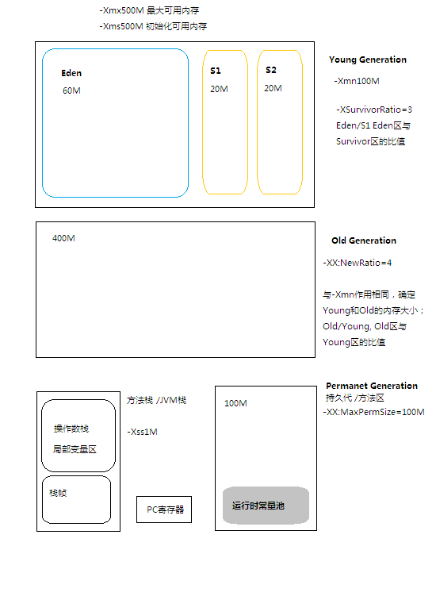
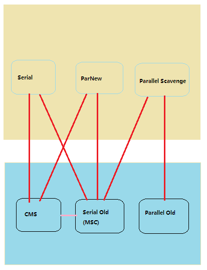

### JVM与内存

*参考书籍*

1. `Java Performance`
2. `深入Java虚拟机`
3. `深入理解Java虚拟机`
4. `The Garbage Collection Handbook`
5. `Oracle JRockit: The Definitive Guide`

构造函数
   
	public class Point {  
		private int x = 1;  // (1)
		private int y = 2;  // (2)

		public  void print(int z){ // (3)
		}  
	}

上面代码中，语句(1)和(2)其实是语法糖，所有的java指令都必须封装在方法中（构造函数也看成是方法）。上面代码等同于如下：

	public class Point {
		private int x;
		private int y;
		public Point() {
			x = 1;
			y = 2;
		}
		public void print(int z){}
	}

当我们编写java语句 new Point()创建一个实例时，编译成的字节码指令为：
	
	new Point
	dup
	invokespecial Point.<init>()V

new指令有两个工作：  

* 为对象在堆中分配内存空间，包括VM所需要的元数据和所有字段(x, y)所需要的空间  
* 初始化对象。x，y初始化为0

invokespecial指令开始调用构造函数。x = 1; y = 2;

*实例方法（包括构造函数）参数列表按顺序从位置1开始存放在局部变量表，局部变量表的位置0用于存放this（一个隐含的参数）；静态方法参数列表按照顺序从位置0开始存放在局部变量表。*

### JVM内存结构

新建对象(new指令 )主要在eden区分配，堆是线程共享的，所以在堆中分配内存空间需要加锁，导致创建对象的开销较大。Hotspot会为每个线程在Eden区分配一块独立的空间TLAB(通过 -XX:TLABWastTargetPercent设置大小，也可以由JVM运行时动态调整)。线程在这个区域加锁分配空间，不用对整个堆空间加锁。如果TLAB空间不足，仍在Eden区分配。

如果创建的是大对象，Eden区无足够空间分配，会直接在Old Generation区分配。如果Old区也无足够空间，则抛出OutOfMemory异常。

### GC

**GC根对象**  
* JVM栈（栈帧中的本地变量表）中的引用对象  
* 方法区中的类静态属性引用对象	  
* 方法区中的常量引用对象  
* 本地方法栈中JNI(Native方法)的引用对象  

**GC垃圾收集器**  
* `Serial`	stop-the-world，复制算法，单线程。  
* `ParNew`	stop-the-world，复制算法，多线程。可以和`CMS`搭配  
* `Parallel Scavenge` stop-the-world， 复制算法，多线程。不能同`CMS`搭配  
* `Serial Old`	stop-the-world， 标记-清除-整理算法，单线程。CMS出现`Concurrent Mode Failure`错误时作为后备方案  
* `Parallel Old` 标记-整理算法，多线程  
* `CMS`	标记-清除算法。

	分为四个阶段：
	1、初次标记GC Roots可以直接关联的对象，速度快，会阻塞用户线程；
	2、并发标记GC Roots引用链，用户线程可以并发执行，运行时间较长；
	3、重新标记，修正阶段2用户线程改变的对象，时间比阶段1长，比阶段2短，会阻塞用户线程；
	4、并发清除 
 	
由于阶段4用户线程也在并发执行，所以需要预留空间给用户线程使用。如果并发清除阶段内存不足，会出现`Concurrent Mode Failure`，导致另外一次Full GC(Serial Old)。

	-XX:+UseSerialGC			Serial				Serial Old  

	-XX:+UseParNewGC			ParNew				Serial Old  

	-XX:+UseConcMarkSweepGC		ParNew				CMS + Serial Old  

	-XX:+UseParallelGC			Parallel Scavenge	Serial Old  

	-XX:+UseParallelOldGC		Parallel Scavenge	Parallel Old  

当Eden区分配对象没有足够空间时，会触发Minor GC。Minor GC会把Eden区和From区存活对象copy到To区，当To区不足存放存活对象时，触发`分配担保机制`，把存活对象移到老年代。Minor GC速度快，频繁

`分配担保机制`。当新生代对象需要移到老年代时，1：如果老年代剩余空间不足，促发Full GC(Major GC)；2:如果老年代不允许担保失败(`HandlePromotionFailure`)，即使剩余空间足够也会进行Full GC
  

https://blogs.oracle.com/jonthecollector/entry/our_collectors

http://rednaxelafx.iteys.com/blog/492667