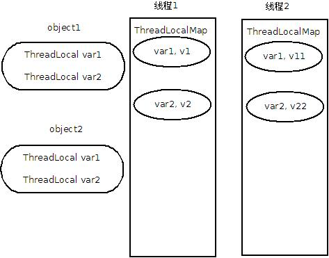

##理解ThreadLocal##

线程间共享数据时，为了保证数据状态一致，通常我们会加锁(`synchronized`, `ReentrantLock`, `CAS`);而线程间保持数据独立，我们就需要用到ThreadLocal。ThreadLocal变量可以使得在多线程间互不影响，接下来我们看一看是怎么实现的。


##### 内存中的对象  

----------

  

```
class Account {  
  ThreadLocal var1;  
  ThreadLocal var2;  
  ......  

  pubic void action(Object obj1， Object obj2) {
    var1.set(obj1);         // (1)
    value = var1.get();     // (2)

    var2.set(obj2);         // (3)
    value = var2.get();     // (4)
  }
}  
```

当前线程对象（如线程1）持有一个ThreadLocalMap属性，该属性只有当前线程对象可操作。ThreadLocalMap内部持有一个Entry数组，每个Entry包含ThreadLocal变量和一个value。

```
//thread1
Object v1, v2; 
...
account.action(v1, v2);
```
当在线程1中调用 action 方法操作Account对象(如account)的ThreadLocal变量(如var1 or var2)时，实际上是操作线程对象1的ThreadLocalMap属性，key 为 var1 or var2，value 为 v1 or v2。

```
//thread2
Object v11, v22; 
...
account.action(v11, v22);
```
当在线程2中调用 action 方法操作Account对象(如account)的ThreadLocal变量(如var1 or var2)时，实际上是操作线程对象2的ThreadLocalMap属性，key 为 var1 or var2(与线程1一样)，value 为 v11 or v22。

每个独立线程操作同一个对象（account）的ThreadLocal变量其实都是操作自己持有的ThreadLocalMap属性，ThreadLocal变量作为 map 的 key，线程中操作的值作为  value。从而确保ThreadLocal变量在线程间保持独立，互不干扰。  


##### 操作流程  
------
以线程1为例：  

* 调用第(1)步时，先获得当前线程(线程1)的ThreadLocalMap属性；如果map不存在，先创建map；把ThreadLocal变量和值构建成一个组合(var1, v1)存入map中。

*Entry在map内部数组定位采用hash算法。与HashMap中数组元素定位不一样，这里只是一个数组，且解决hash冲突(hash位置相同，key不同)的方式是以当前hash位置重新计算目标位置，而不是采用链表的方式*

* 调用第(2)步时，通过var1找到在map中的hash位置，提取出Entry中的值。  

##### ThreadLocal与内存泄漏  
-----
当 account 对象不在作用域时，不再被其他对象引用，可以被GC回收掉。如果线程1对象仍是存活状态，不能被GC，这时线程1对象持有的ThreadLocalMap属性中持有的Entry(var1, v1)也不能被回收（仍被有效对象引用），造成Entry(var1, v1)是废对象的同时也不能被回收，发生内存泄漏。

处理方式：在 account 不在有效作用域之前调用ThreadLocal变量的`remove`方法。
