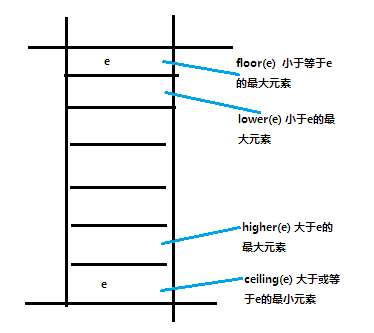
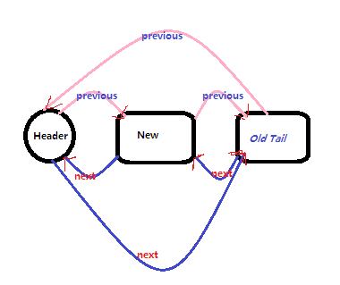

### Java集合框架

##

* ArrayList（数组）

add(E)，从尾部加入  

add(index, E)，先(使用array copy)移动index之后的元素，再把元素加入指定位置

set(index, E)， 替换指定位置的元素

* LinkedList（双向链表）

*header为访问入口*

* HashSet

内部使用`HashMap`，元素作为key，new Object()作为value（仅作为占位，无意义）。

* TreeSet

内部使用`TreeMap`，元素作为key，new Object()作为value（仅作为占位，无意义）。

* TreeMap(红黑树)

*参考[平衡查找树](../design/算法.html)*

默认根据key排序，可自定义Comparator

* HashMap(数组 + 链表)

  HashMap内部数据结构为数组 +  链表（解决hash冲突，不同key相同hash值）。

  当HashMap中元素个数超过阈值时，需扩容数组，并对所有元素重新计算hash加入到新数组。当数组达到最大长度，只能加入链表（可以实现无线元素内容）。

  HashMap中处理元素的流程：  
	1. 根据 Key 计算 hash  
	2. 根据 hash 计算元素在数组中的 index  
	3. 根据 数组[index] 作为链表头依次与指定对象比较，直到找到在链表中的目标位置。

* Vector 数组

类似`ArrayList`，使用synchronized表示实现安全操作。

* Hashtable

类似`HashMap`，Key 和 value 不能为null。使用synchronized标志实现安全操作。

key必须实现hashCode() and equals()

当元素个数 >= 容量(capacity) * 加载因子(loadFactor)，执行 rehash()

* ConcurrentHashMap

内部为Segment数组，每个Segment相当于一个HashMap，对Segment的操作使用ReentrantLock进行加锁实现安全操作，同时不妨碍其他Segment的操作。

当Segment的元素个数超过阈值，对本Segment执行rehash

* LinkedBlockingDeque（阻塞式双端队列， 读写用同一个锁）

使用读写锁

push(e) -> addFirsh(e) -> offerFirst(e)`加锁操作，不保证插入成功` -> linkFirst(e)

putFirst(e)`加锁操作，保证插入成功` -> linkFirst(e)

add(e) -> addLast(e) -> offerLast(e) `加锁操作，不保证插入成功` -> linkLast(e)

put(e) -> putLast(e) `加锁操作，保证插入成功` -> linkLast(e)

offer(e) -> offerLast(e) -> linkLast(e)

*提取队列头元素，并修改队列头*  
pop() -> removeFirst() -> pollFirst() `加锁操作，不保证取到元素` -> unLinkFirst()

poll() -> pollFirst() -> unLinkFirst()

*提取队列头元素，不修改队列头*  
peek()

* LinkedBlockingQueue(读写锁分离)

put(e)  用 put 锁，元素加到队列尾。确保元素能添加成功（等待重试）

offer(e) 用 put 锁，元素加到队列尾。不保证元素添加成功

peek() 用 take 锁，提取头元素，但不删除。不保证获取成功

poll() 用 take 锁，提取并删除头元素。不保证获取成功

take() 用 take 锁，提取并删除头元素。确保获得元素

* PriorityQueue

用数组存储，体现为二叉树。

