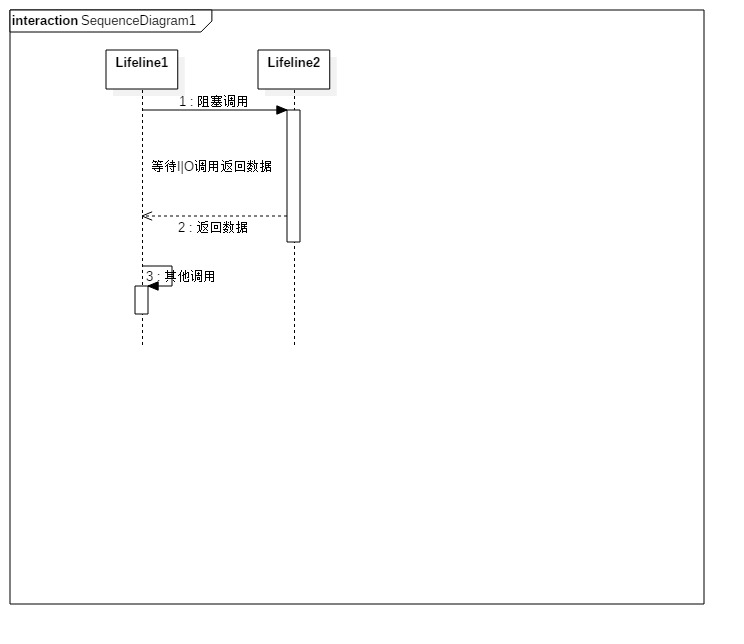
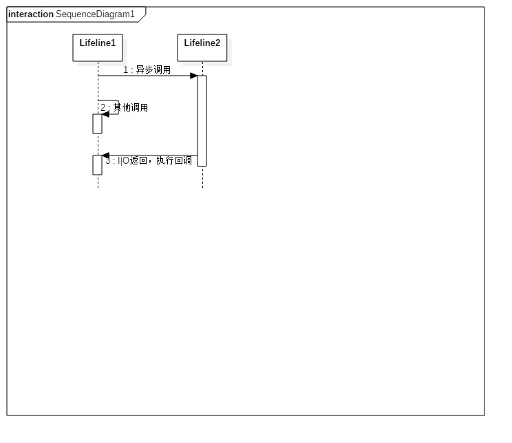
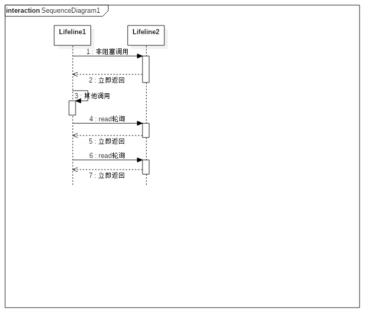
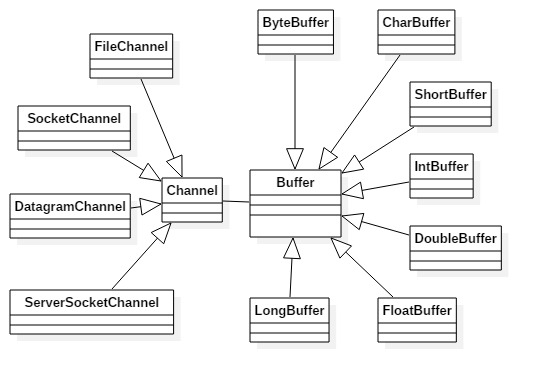
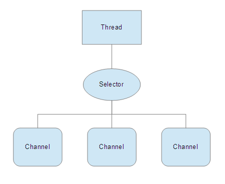
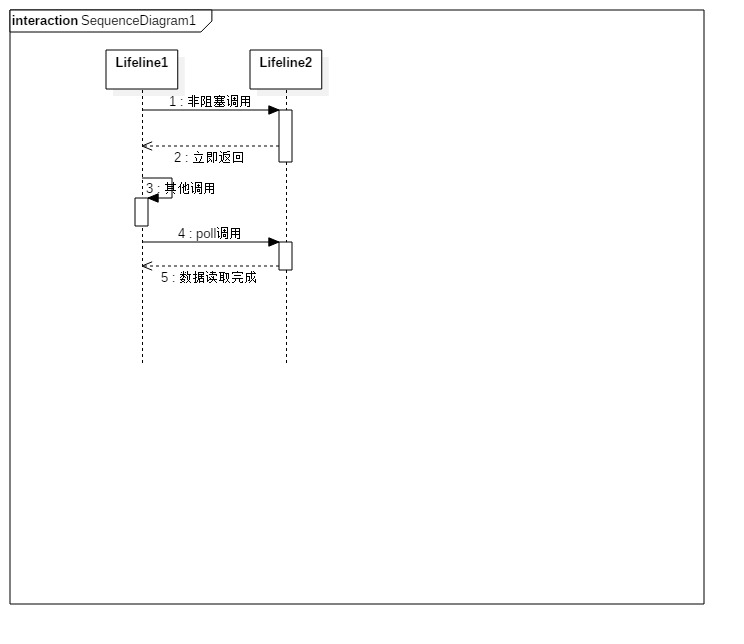
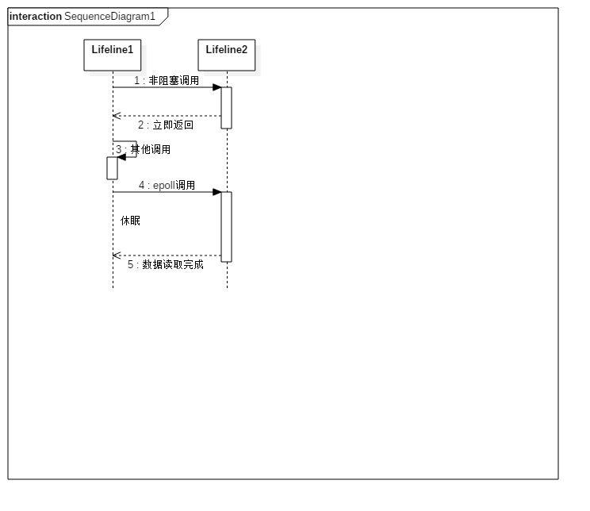

**BIO**



```
```

**AIO**



**NIO(read)**



**NIO(select)**


```
// 创建Selector
Selector selector = Selector.open();

// 注册通道
channel.configureBlocking(false); // Channel为非阻塞模式(FileChannel为阻塞模式)
// Selector可以监听Connect, Accept, Read, Write事件。
SelectionKey key = channel.register(selector, SelectionKey.OP_READ);

while(true) {
    int readyChannels = selector.select();
    if(readyChannels == 0) continue;

    Set selectedKeys = selector.selectedKeys();
    Iterator keyIterator = selectedKeys.iterator();
    while(keyIterator.hasNext()) {
        SelectionKey key = keyIterator.next();
        if(key.isAcceptable()) {
            // a connection was accepted by a ServerSocketChannel
        } else if(key.isConnectable()){
            // a connection was established with a remote server
        } else if(key.isReadable()) {
            // a channel is ready for reading
        } else if(key.isWritable()) {
            // a channel is ready for writing
        }

        keyIterator.remove();
    }
}
```



数据可以从 Channel 读取到 Buffer 中，也可以从 Buffer 写到 Channel 中。

Channel类似流，但流中数据的读写是单向的(InputStream and OutputStream)。

Channel可以异步读写

Channel操作数据总会先经过Buffer。

`FileChannel` 从文件中读写数据；  
`DatagramChannel` 通过UDP读写网络中的数据；  
`SocketChannel` 通过TCP读写网络中的数据；  
`ServerSocketChannel` 监听新进来的TCP连接；
http://ifeve.com/channels/



Selector允许单线程处理多个Channel。如果应用打开了多个连接(通道)，但每个连接的流量都很低，使用Selector就很方便。

要使用Selector，先向Selector注册Channel，然后调用Selector的select()方法。select方法会阻塞到注册的某个通道有事件就绪。

**NIO(poll)**



**NIO(epoll)**


