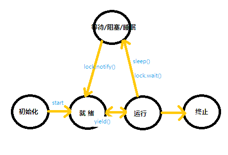

## 多线程与锁 ##

* **线程状态转换**

1、new Thread()，使线程对象呈初始化状态  

2、thread.start()，使线程进入就绪状态  

3、就绪线程分配到cpu时间片，（如果需要锁先要获取锁）进入运行状态。需要锁的情况下，如果别的线程持有了锁则不能进入运行状态  

4、调用Thread.`sleep`()，线程进入睡眠状态，不释放持有的锁。  

5、调用Thread.`yield`()，当前线程让出执行权利，进入就绪状态, 不会释放锁  

6、线程持有的锁调用lock.`wait`()时，线程进入等待状态。当前线程释放持有的锁。  

7、当两个线程同时竞争一把锁时，竞争失败的进入阻塞状态；通道上的IO操作会阻塞线程    
8、睡眠状态的线程经过指定的睡眠时间后进入就绪状态。  

9、等待状态的线程经过指定的时间(lock.wait(xxx))后进入就绪状态。如果线程是因为等待锁(lock.wait())而进入等待状态的，需要等待其他持有该锁的线程调用lock.`notify`() or lock.notifyAll()后，等待线程才能进入就绪状态。  

10、线程没有需要再执行的字节码，进入终止状态。  

11、如果当前线程并未持有某个锁lock，调用lock的wait 或  notify 方法，会抛出 IllegalMonitorStateException异常。  

12、thread.interrupt()方法只是设置线程thread的interrupted标志位，并不会阻塞线程执行。如果线程是等待/阻塞/睡眠状态，会抛出InterruptedException；如果线程因IO而阻塞，会抛出ClosedByInterruptException；如果线程因Selector而阻塞，会设置状态立即返回  

13、thread.join(x)，阻塞当前线程，等待thread线程终止或x毫秒后（两个条件满足一个即可），当前线程进入就绪状态。(join通过使用 wait 实现)  

14、daemon==true的线程，非daemon线程终止时，daemon线程也随之结束（即使当时daemon线程仍在运行中）。也就是说只有daemon线程是活动状态时，JVM可以退出执行。

##### 使用关键字synchronized

使用synchronized关键字，可以让被保护的代码块串行执行（持有锁的线程可以执行）。

	class Account {
		public static synchronized void print() {
			// lock is Account.class 
		}
	}

	class Account {
		public snchronized void print() {
			// lock is this
		}
	}

	class Account {
		private violatile boolean lockObj;

		public void print() {
			synchronized(lockObj) {
				// lock is lockObj
			}
		}
	}

执行 synchronized修饰的同步块时，如果当前线程不能获取锁，则会一直阻塞。

##### concurrent包与ReentrantLock

	ReentrantLock lock = new ReentrantLock()
	lock.lock();  //尝试获取锁，未获取到锁就阻塞 
	// lock.tryLock();	// 尝试获取锁，获取成功返回true，获取失败返回false，不会阻塞
	lock.unlock(); // 如果当前线程没有持有锁lock，则抛出IllegalMonitorStateException异常，否则正常释放锁。可以使用isHeldByCurrentThread()判断是否被当前线程持有。

ReentrantLock默认使用非公平锁，也可以选择使用公平锁（公平锁在某些场景下性能反而不好）。同时使用tryLock也可以避免未获取锁时一直阻塞当前线程。

同时concurrent包还实现了ReentrantReadWriteLock，实现了读锁和写锁分离。

	// 代码来源于jdk源码
	class CachedData {
		Object data;
		volatile boolean cacheValid;
		ReentrantReadWriteLcok lock = new ReentrantReadWriteLock();

		void process(){
			lock.readLock().lock();
			if(!cacheValid){
				// 需要先释放读锁才能获取写锁
				lock.readLock().unlock();
				lock.writeLock().lock();
				// 需要再次检查cacheValid，因为其他线程可能先获取写锁再修改cacheValid值
				if(!cacheValid) {
					data = ...
					cacheValid = true;
				}
				// 释放写锁前，通过获取读锁降级
				lock.readLock().lock();
				lock.writeLock().unlock(); // 释放写锁，仍持有读锁 
			}
			use(data);
			lock.readLock().unlock();
		}
	}

##### concurrent包其他同步器

除了互斥排他锁、读写锁，还有`信号量`、`屏障`、`Future`、`事件指示器`以及`传送队列`等同步器
