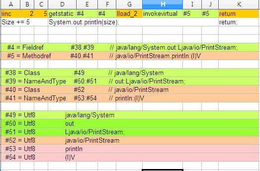

###javap###

```
 javap [options] classfile
 
 可选 options
 -l               显示行号(源代码行与class中指令偏移量)和本地变量表
 -public          仅显示public的class及members  
 -protected       仅显示public和protected的class和member
 -private(-p)     显示所有的class和member
 -s               显示(方法和成员)internal type signatures
 -sysinfo         显示待处理类的系统信息(path, size, date, MD5 hash)
 -constants       显示常量(static final)
 -c               打印反编译代码
 -verbose         打印操作数栈大小，本地变量数量，方法参数的数量
 -classpath       javap操作的类所在的路径
 -bootclasspath
 -extdir
```

```
AnaTool.java
public class AnaTool {
  private String name;
  String code = "001";
  protected String step;
  public String status;
  public static final String sys = "";

  public void p0(String type, int size){
    size += 5;
    System.out.println(size);
  }
  private void p1() {

  }
  void p2() {
  }
}
```

**javap -s AnaTool**

```
E:\>javap -s AnaTool
Compiled from "AnaTool.java"
public class AnaTool {
  java.lang.String code;
    descriptor: Ljava/lang/String;
  protected java.lang.String step;
    descriptor: Ljava/lang/String;
  public java.lang.String status;
    descriptor: Ljava/lang/String;
  public static final java.lang.String sys;
    descriptor: Ljava/lang/String;
  public AnaTool();
    descriptor: ()V

  public void p0(java.lang.String, int);
    descriptor: (Ljava/lang/String;I)V

  void p2();
    descriptor: ()V
}
```

**javap -sysinfo AnaTool**

```
E:\>javap -sysinfo AnaTool
Classfile /E:/AnaTool.class
  Last modified 2016-5-30; size 898 bytes
  MD5 checksum cbf392524f148a7429ef56eb943bff7d
  Compiled from "AnaTool.java"
public class AnaTool {
  java.lang.String code;
  protected java.lang.String step;
  public java.lang.String status;
  public static final java.lang.String sys;
  public AnaTool();
  public void p0(java.lang.String, int);
  void p2();
}
```

**javap -public AnaTool**

```
E:\>javap -public AnaTool
Compiled from "AnaTool.java"
public class AnaTool {
  public java.lang.String status;
  public static final java.lang.String sys;
  public AnaTool();
  public void p0(java.lang.String, int);
}
```

**javap -protected AnaTool**

```
E:\>javap -protected AnaTool
Compiled from "AnaTool.java"
public class AnaTool {
  protected java.lang.String step;
  public java.lang.String status;
  public static final java.lang.String sys;
  public AnaTool();
  public void p0(java.lang.String, int);
}
```

**javap -private AnaTool**

```
E:\>javap -private AnaTool
Compiled from "AnaTool.java"
public class AnaTool {
  private java.lang.String name;
  java.lang.String code;
  protected java.lang.String step;
  public java.lang.String status;
  public static final java.lang.String sys;
  public AnaTool();
  public void p0(java.lang.String, int);
  private void p1();
  void p2();
}
```

**javap -constants AnaTool**

```
E:\>javap -constants AnaTool
Compiled from "AnaTool.java"
public class AnaTool {
  java.lang.String code;
  protected java.lang.String step;
  public java.lang.String status;
  public static final java.lang.String sys = "";
  public AnaTool();
  public void p0(java.lang.String, int);
  void p2();
}
```


**javap -c AnaTool**

```
E:\>javap -c AnaTool
Compiled from "AnaTool.java"
public class AnaTool {
  java.lang.String code;

  protected java.lang.String step;

  public java.lang.String status;

  public static final java.lang.String sys;

  // 由编译器创建的默认构造函数
  public AnaTool();
    Code:
       0: aload_0
       1: invokespecial #1             // Method java/lang/Object."<init>":()V
       // 把源代码中成员的赋值语句(语法糖)编译成字节码并放到构造函数里
       4: aload_0
       5: ldc           #2             // String 001
       7: putfield      #3             // Field code:Ljava/lang/String;
      10: return

  public void p0(java.lang.String, int);
    Code:
       0: iinc          2, 5
       3: getstatic     #4             // Field java/lang/System.out:Ljava/io/PrintStream;
       6: iload_2
       7: invokevirtual #5             // Method java/io/PrintStream.println:(I)V
      10: return

  void p2();
    Code:
       0: return

}
```


**javap -l AnaTool**

```
E:\>javap -l AnaTool
Compiled from "AnaTool.java"
public class AnaTool {
  java.lang.String code;

  protected java.lang.String step;

  public java.lang.String status;

  public static final java.lang.String sys;

  public AnaTool();
    LineNumberTable:
      line 1: 0
      line 3: 4

  public void p0(java.lang.String, int);
    LineNumberTable:
      line 9: 0
      line 10: 3
      line 11: 10

  void p2();
    LineNumberTable:
      line 16: 0
}
```


我们以p0方法为例：
```
 源代码：
  public void p0(String type, int size){
    size += 5;                 //(line 9)
    System.out.println(size);  //(line 10)
  }
```

javap -l 显示行号与字节码偏移对应关系：
```
  public void p0(java.lang.String, int);
    LineNumberTable:
      line 9: 0        // 从偏移位置0开始
      line 10: 3       // 从偏移位置3开始
      line 11: 10      // 从偏移位置10开始（编译器生成的一个return指令）
```


我们看 javap -c 打印信息更加详细：  
```
  public void p0(java.lang.String, int);
    Code:
      0: iinc          2, 5
      3: getstatic     #4  // Field java/lang/System.out:Ljava/io/PrintStream;
      6: iload_2
      7: invokevirtual #5  // Method java/io/PrintStream.println:(I)V
     10: return 
```

方法中的第一行代码（在源代码文件中是第9行）`size += 5;`编译后为1条虚拟机指令：iinc  2, 5。从偏移位置（相对于方法）0开始，字节码指令 iinc占一个字节，参数2(代表本地变量2)占1个字节，参数5（常量值5）占一个字节。该行代码总共占3个字节。

所以第二行代码(在源代码文件中是第10行)`System.out.println(size);`从偏移位置3开始。字节码指令getstatic占1个字节，参数占2个字节(getstatic #indexbyte1 #indexbyte2)，这里的参数由`#4`表示；iload_2指令占1个字节；invokevirtual指令占1个字节，参数占2个字节(invokevirtual #indexbyte1 #indexbyte2)，这里的参数由`#5`表示。该行代码总共占7个字节。

所以最后由编译器生成的 return 指令从偏移位置10开始。

这里由一点需要注意，两个参数的位置由 #4 和 #5表示，这两个值可以在运行时常量池中找到(可以通过 javap -verbose 查看)。

  

通过javap -verbose指令我们可以看到:

`#4` 是一个 Fieldref(System类的out成员，类型为java.io.PrintStream)。`#4`又引用到`#38`和`#39`。`#38`正好引用到System类(`#49`为字符串表示)；`#39`又间接引用到`#50`, `#51`。`#50`为实例对象out的字符串名称，`#51`为引用到的PrintStream类的字符串表示。
 
`#5`是一个 MethodRef(PrintStream的println方法)。`#5`又引用到`#40`, `#41`。`#40`正好引用到PrintStream类(`#52`为字符串表示)；而`#41`又间接引用到`#53`, `#54`。`#53`引用实例方法println的字符串表示，`#54`指向(I)V，表示参数是int，返回值为void。

PrintStream的println方法重载多个（参数不一样），`#5`[`#40`[`#52`], `#41`[`#53`, `#54`]]表示我们使用的是PrintStream类的输入参数为int，返回值为void的println方法。

**javap -verbose AnaTool**

```
E:\>javap -verbose AnaTool
Classfile /E:/AnaTool.class
  Last modified 2016-5-30; size 913 bytes
  MD5 checksum 0c08677ba3dafa2dd3d94eebe9e2d52c
  Compiled from "AnaTool.java"
public class AnaTool
  minor version: 0
  major version: 52
  flags: ACC_PUBLIC, ACC_SUPER
Constant pool:
   #1 = Methodref          #12.#35        // java/lang/Object."<init>":()V
   #2 = String             #36            // 001
   #3 = Fieldref           #11.#37        // AnaTool.code:Ljava/lang/String;
   #4 = Fieldref           #38.#39        // java/lang/System.out:Ljava/io/PrintStream;
   #5 = Methodref          #40.#41        // java/io/PrintStream.println:(I)V
   #6 = Methodref          #42.#43        // java/lang/Thread.currentThread:()Ljava/lang/Thread;
   #7 = Long               1000l
   #9 = Methodref          #42.#44        // java/lang/Thread.sleep:(J)V
  #10 = Class              #45            // java/lang/Exception
  #11 = Class              #46            // AnaTool
  #12 = Class              #47            // java/lang/Object
  #13 = Utf8               name
  #14 = Utf8               Ljava/lang/String;
  #15 = Utf8               code
  #16 = Utf8               step
  #17 = Utf8               status
  #18 = Utf8               sys
  #19 = Utf8               ConstantValue
  #20 = String             #48            //
  #21 = Utf8               <init>
  #22 = Utf8               ()V
  #23 = Utf8               Code
  #24 = Utf8               LineNumberTable
  #25 = Utf8               p0
  #26 = Utf8               (Ljava/lang/String;I)V
  #27 = Utf8               p1
  #28 = Utf8               p2
  #29 = Utf8               main
  #30 = Utf8               ([Ljava/lang/String;)V
  #31 = Utf8               StackMapTable
  #32 = Class              #45            // java/lang/Exception
  #33 = Utf8               SourceFile
  #34 = Utf8               AnaTool.java
  #35 = NameAndType        #21:#22        // "<init>":()V
  #36 = Utf8               001
  #37 = NameAndType        #15:#14        // code:Ljava/lang/String;
  #38 = Class              #49            // java/lang/System
  #39 = NameAndType        #50:#51        // out:Ljava/io/PrintStream;
  #40 = Class              #52            // java/io/PrintStream
  #41 = NameAndType        #53:#54        // println:(I)V
  #42 = Class              #55            // java/lang/Thread
  #43 = NameAndType        #56:#57        // currentThread:()Ljava/lang/Thread;
  #44 = NameAndType        #58:#59        // sleep:(J)V
  #45 = Utf8               java/lang/Exception
  #46 = Utf8               AnaTool
  #47 = Utf8               java/lang/Object
  #48 = Utf8
  #49 = Utf8               java/lang/System
  #50 = Utf8               out
  #51 = Utf8               Ljava/io/PrintStream;
  #52 = Utf8               java/io/PrintStream
  #53 = Utf8               println
  #54 = Utf8               (I)V
  #55 = Utf8               java/lang/Thread
  #56 = Utf8               currentThread
  #57 = Utf8               ()Ljava/lang/Thread;
  #58 = Utf8               sleep
  #59 = Utf8               (J)V
{
  java.lang.String code;
    descriptor: Ljava/lang/String;
    flags:

  protected java.lang.String step;
    descriptor: Ljava/lang/String;
    flags: ACC_PROTECTED

  public java.lang.String status;
    descriptor: Ljava/lang/String;
    flags: ACC_PUBLIC

  public static final java.lang.String sys;
    descriptor: Ljava/lang/String;
    flags: ACC_PUBLIC, ACC_STATIC, ACC_FINAL
    ConstantValue: String

  public AnaTool();
    descriptor: ()V
    flags: ACC_PUBLIC
    Code:
      stack=2, locals=1, args_size=1
         0: aload_0
         1: invokespecial #1                  // Method java/lang/Object."<init>":()V
         4: aload_0
         5: ldc           #2                  // String 001
         7: putfield      #3                  // Field code:Ljava/lang/String;
        10: return
      LineNumberTable:
        line 1: 0
        line 3: 4

  public void p0(java.lang.String, int);
    descriptor: (Ljava/lang/String;I)V
    flags: ACC_PUBLIC
    Code:
      stack=2, locals=3, args_size=3
         0: iinc          2, 5
         3: getstatic     #4                  // Field java/lang/System.out:Ljava/io/PrintStream;
         6: iload_2
         7: invokevirtual #5                  // Method java/io/PrintStream.println:(I)V
        10: return
      LineNumberTable:
        line 9: 0
        line 10: 3
        line 11: 10

  void p2();
    descriptor: ()V
    flags:
    Code:
      stack=0, locals=1, args_size=1
         0: return
      LineNumberTable:
        line 16: 0
}
SourceFile: "AnaTool.java"
```
