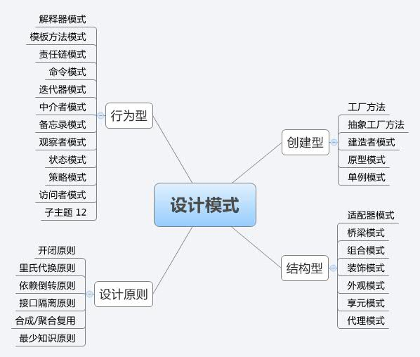

### 理解设计模式

* **设计原则**
  * 开闭原则

	*----对扩展开发，对修改关闭*
	> 例如冷饮店最开始只销售汽水和可乐，那我们可以设计一个抽象类饮料（Drink），设计两个子类(Steamwater, Colar)，再设计一个工厂类(DrikFactory)。当冷饮店增加售卖茶时，只需要新增一个子类(Tea)即可扩展功能，无需(大幅)修改(影响)原有功能。
	> 
	> DrinkFactory.buildDrink("Steamwater"); ...

  * 里氏代换原则
  
	*----如果调用的是父类的话，换成子类也完全可以运行（但是行为细节可能不一样）*

  * 依赖倒转原则

	*----依赖接口编程*

  * 接口隔离原则
  
	*----客户端不应该依赖它不需要的接口*

  * 合成/聚合原则

	*----新对象尽量使用一些已有的对象，使之成为新对象的一部分。新对象通过像已有对象委派任务达到复用的目的。尽量使用合成/聚合，尽量避免集成*

  * 最少知识原则(迪米特法则)
  
	*----一个对象应对其他对象有尽可能少的了解*

  * 单一职责原则

	*----一个类(或方法)只负责一项职责*

* **设计模式**
  * 工厂方法

	*----分离对象的创建与使用过程。*	

	<pre></code>
	class CarFactory {  
		public static Car build(){
		}  
	}
	</code></pre>

  * 抽象工厂方法
  
	*----创建的对象变得复杂，而且对象成系列(如中国产系列和美国产系列)时，可以使用抽象工厂方法*
	
	<pre></code>
	abstract class CarFactory {  
		public abstract Car build(){
		}  
	}
	class ChinaCarFactory {  
		public Car build(){
		}  
	}
	class UsaCarFactory {  
		public Car build(){
		}  
	}
	</code></pre>

----------

  * 适配器模式

	*----将某个类的接口转换成用户希望的另外一个接口。适配器使得原本不兼容的接口可以一起工作。*

	旧系统已实现某些功能，但是不符合新系统的接口时，可以使用该模式

	// 对象适配器模式
	//old
	class XmlParser {
		void parse(XMLFile)
	}
	// new
	interface Parser{
		void parse(File);
	}

	Class ConfigParser implements Parser {
		XmlParser xmlParser;

		void parse(File){
			if(File is XML) {
				xmlParser.parse((XmlFile)File);
			} else {
				parse((PropFile)File);
			}
		}
		void parse(PropFile)
	}

	// 类适配器模式
	// old
	class XmlParser {
		void parseXML(XMLFile)
	}
	// new
	interface Parser {
		void parseXML(XMLFile);
		void parseProp(PropFile);
	}

	class ParserAdapter extends XmlParser implements Parser {
		void parseProp(PropFile)
	}

	// 缺省适配器模式， 在适配器接口Parser中实现一些默认行为

  * 代理模式

	*----为其他对象提供一种代理，以控制对这个对象的访问*

	`远程代理`, `虚拟代理`, `保护(安全)代理`, `智能指引`, `Copy-on-Write代理`

	在Ibatis中，SqlMapExecutorDelegate(代理类)就可以看成是一个对SqlExecutor(委托类)的代理

	> class SqlMapExecutorDelegate {
	>   SqlExecutor sqlExecutor;

	>   int update(session, id, param) {
	>     // 通过SqlExecutor执行jdbc操作。
	>   }
	> }
  * 装饰模式

	*----动态为对象增加一些额外的职责。*

	> InputStreamReader.read()每次读取字符是直接从InputStream读取，性能较差；
	> 
	> new BufferedReader(new InputStreamReader(System.in))  
	> new BufferedReader(new FileReader("file.tx"))
	> 
	> BufferedReader.read()可以对InputStreamReader.read()进行装饰，增加字符缓冲功能，每次读取的时候会尽量读取填充到满本地buffer数组，后续read调用可以从buffer数组中读取，减少从InputStream中读取带来的性能损耗。

  * 组合模式

	*----将对象组合成树形结构，以表示'部分--整体'的层次结构。客户对单个对象和复合对象的使用具有一致性*

	<pre><code>
	// Component  
	interface Organize{  
	  void add(org);  
	  void remove(org);
	  int members();
	}
	 
	// Composite
	class Company implements Organize{
	  List orgs;
	  void add(org){
	    orgs.add(org);
	  }
	  void remove(org) {
	    orgs.remove(org);
	  }

	  int members(){
	    int total = 0;
	    for(org in orgs) {
	      total += org.members();
	    }
	  }
	}
	
	// Leaf
	class Department implements Organize{
	  int num;
	  void add(org);    // 多余方法
	  void remove(org); // 多余方法
	  
	  int members(){
	    return num;
	  }
	}
	</code></pre>

-----

  * 解释器模式
  * 模板方法模式

	*----在模板方法中定义算法骨架，在具体实现中细化具体细节*

	<pre><code>
	abstract class CarBuild{
		public void build(){
			buildEngine();
			buildWheel();
		}

		protected abstract buildEngine();
		protected abstract buildWheel();
	}
	class TruckBuild extends CarBuild{}
	class BusBuild extends CarBuild{}
	
	// 子类只关心具体细节，而客户端不关心细节，只关心能否造车即可。
	</code></pre>

  * 责任链模式

	*----处理者角色持有下一个处理者角色的引用，处理者可以决定自己处理还是交给下一个处理者处理*

  * 命令模式
  
	*----把客户端请求封装成命令*

	<pre><code>
	class Tv{
		void turnOn();
		void turnOff();
		void change();
	}

	interface Command{
		void execute();
	};

	class CommandOn implements Command{
		Tv tv;
		void execute(){
			tv.turnOn();
		}
	}

	class CommandOff implements Command{
		Tv tv;
		void execute(){
			tv.turnOff();
		}
	}

	class TvController {
		Tv tv;
		Command on = new CommandOn(tv);
		Command off = new CommandOff(tv);

		void turnOn(){
			on.execute();
		}
		void turnOff(){
			off.execute();
		}
	}

	// 优点是新增命令很容易，请求调用和请求处理解耦；缺点是具体命令实现可能非常多
	</code></pre>

  * 观察者模式

	*----对象存在一对多的依赖关系，对象状态改变时，依赖的状态需要得到通知。观察者模式可以解除对象对依赖对象的强耦合关系*

	<pre><code>
	class 发令枪 {
		listeners[];
		
		void 鸣枪(){
			for(listener in listeners) {
				lisener.action();
			}
		}
	}

	class 运动员 {
		void action(){
			// 跑步
		}
	}
	class 观众 {
		void action() {
			// 呐喊助威
		}
	}
	</code></pre>	

  * 状态模式

	*----允许一个类在其内部状态改变时改变它的行为方式*

	<pre><code>
	class GoodsSoldVO{
		Items[] items; // goods，顾客实际将获得的物品
		Money money;   // 顾客将实际支付的价格
		
	}	

	interface GoodsState {
		void sold();
	}
	NormalState implements GoodsState{
		<Good, price> sold();
	}
	DiscountState implements GoodsState{
		<Good, discountPrice> sold();
	}
	PromotionState implements GoodsState{
		<Items, promotionPrice> sold();
	}
	</code></pre>

  * 策略模式
	
	*----可以定义一系列算法，算法与客户端分离。客户端需要知道那些算法可用*
	<pre><code>
	interface TravelRoute{
		Site[] calc(from, to);
	}
	class BusTravelRoute implements TravelRoute {
	}
	class FootRoute implements TravelRoute {
	}
	</code></pre>

  * 访问者模式